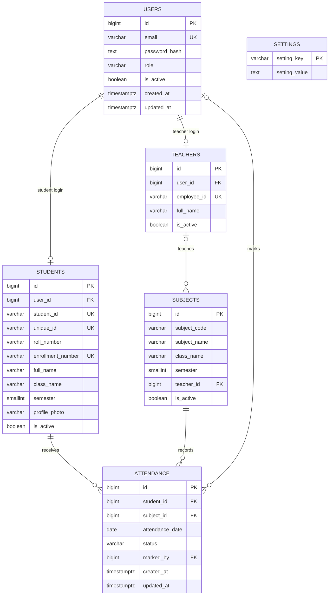

# Database design

The system uses PostgreSQL and `node-postgres` (`pg`). SQL migrations live in `server/src/db/migrations/` and are tracked in `schema_migrations`. The migration runner applies ordered `.sql` files inside a transaction. No manual table creation is required.

## Entity relationship diagram



## Tables and constraints

### `users`

One row per login. Email is normalized to lowercase by the API and is unique. Passwords are stored as bcrypt hashes (12 rounds in account-creation paths); plaintext passwords are not persisted or returned. `role` is constrained to `ADMIN`, `TEACHER`, or `STUDENT`. Disabling an account sets `is_active = false`.

### `students`

A one-to-one extension of a student login (`user_id` is unique and references `users.id`). Stores student ID, unique institution ID, roll number, enrollment number, full name, parent/guardian name, blood group, class, semester, and a generated photo filename reference. Student ID, unique ID, and enrollment number are unique. Roll number is unique within `(class_name, semester)`. Semester is constrained to 1–12. Student deletion is a soft deactivation so attendance history remains referentially valid.

### `teachers`

A one-to-one extension of a teacher login. Employee ID is unique. Teacher deactivation disables the account and unassigns active subject rows (sets `teacher_id` to null), while preserving attendance records.

### `subjects`

Stores a subject code/name, class, semester, optional assigned teacher, and active flag. `(subject_code, class_name, semester)` is unique. Semester is constrained to 1–12. Deactivation is soft and does not erase history.

### `attendance`

Each record links one student, one subject, one date, one status (`PRESENT` or `ABSENT`), and the user who marked it (nullable if that user is later removed). The unique constraint `(student_id, subject_id, attendance_date)` prevents duplicates. The batch mark endpoint uses PostgreSQL `INSERT ... ON CONFLICT ... DO UPDATE` as the deliberate correction path. Corrections update `updated_at` and `marked_by`.

### `settings`

Key/value configuration. `low_attendance_threshold` is installed at `75` for a new database and can be changed through the admin Settings page/API. All dashboard alerts, low-attendance lists, and UI warnings use this persisted value.

### `schema_migrations`

Internal ledger containing the name and application timestamp of each migration file. Do not edit applied migration files in a deployed database; add a new numbered migration for future schema changes.

## Indexes and referential behavior

- Primary keys are `BIGSERIAL`.
- Student search has a functional index on `lower(full_name)` and an active class/semester index. Identifier search also benefits from unique indexes.
- Subject teacher, attendance date, student/date, and subject/date access paths are indexed.
- Student/subject attendance foreign keys use `ON DELETE RESTRICT` so history cannot be accidentally cascade-deleted.
- Subject-to-teacher and attendance-to-marker references use `ON DELETE SET NULL` where preserving historical rows is useful.
- The application uses soft deactivation instead of physical deletion for core entities.

## Attendance calculation

For a student/subject (or all scoped subjects):

```text
attendance percentage = present records / all recorded records × 100
```

The server rounds to one decimal place consistently. Total is the count of `PRESENT` plus `ABSENT` records; a class with no records has a `0.0%` percentage. Missing attendance rows are not treated as `ABSENT`; a teacher must submit a roster to create records. Active subjects with no marks are returned in subject summaries with total/present/absent equal to zero. Inactive students are omitted from active rosters and dashboards; their historical records remain stored.

`class_name` is intentionally a text field rather than a separate classes table: it keeps the BCA-project model easy to explain while still enforcing class/semester consistency between a subject and its roster in the attendance service.
